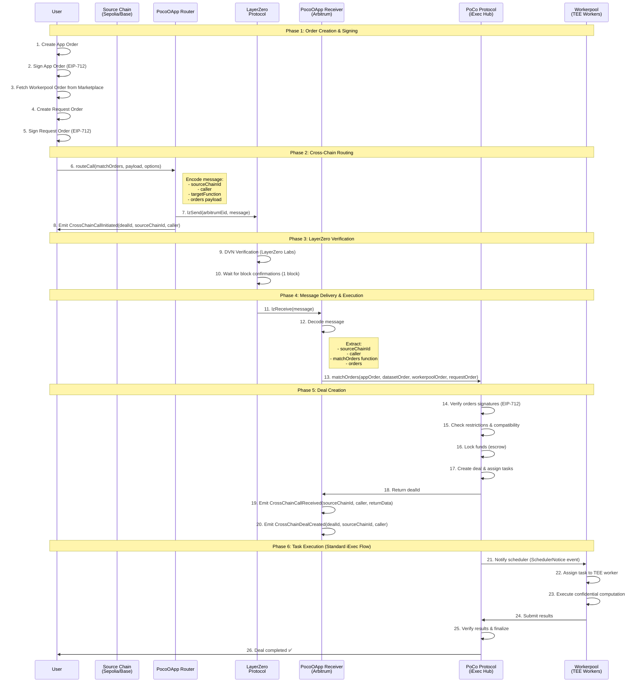

# iExec Cross-Chain via LayerZero

Cross-chain PoCo (Proof-of-Contribution) execution for iExec using LayerZero V2 OApp architecture.

This project enables **confidential computing tasks** to be triggered from **any EVM chain** (Sepolia, Base, etc.) and executed on **Arbitrum** where the iExec PoCo protocol is deployed.

## 📦 Packages

This monorepo contains two packages:

### 1. `packages/layerzero/` - LayerZero OApp Contracts

Smart contracts implementing the LayerZero OApp standard for cross-chain routing and receiving.

- **Router Mode**: Deployed on source chains (Sepolia, Base, etc.)
- **Receiver Mode**: Deployed on Arbitrum (executes on PoCo)
- Solidity contracts with Hardhat deployment
- LayerZero configuration and wiring

[📖 Read LayerZero Package Documentation](./packages/layerzero/README.md)

### 2. `packages/cross-chain-tx/` - Transaction Scripts

TypeScript scripts to create and send cross-chain iExec transactions.

- ESM-native with `tsx` (no build step)
- iExec SDK integration for order management
- Viem for type-safe Ethereum interactions
- Support for multiple source chains

[📖 Read Cross-Chain TX Package Documentation](./packages/cross-chain-tx/README.md)

## 🏗️ Architecture

```
┌─────────────────────────────────────────────────────────────────────────┐
│                           SOURCE CHAINS                                 │
│  ┌──────────────────┐         ┌──────────────────┐                    │
│  │  Sepolia         │         │  Base Sepolia    │                    │
│  │                  │         │                  │                    │
│  │  PocoOApp        │         │  PocoOApp        │                    │
│  │  (Router Mode)   │         │  (Router Mode)   │                    │
│  └────────┬─────────┘         └────────┬─────────┘                    │
│           │                             │                               │
└───────────┼─────────────────────────────┼───────────────────────────────┘
            │                             │
            │         LayerZero           │
            │         Messaging           │
            │         Protocol            │
            │                             │
┌───────────┼─────────────────────────────┼───────────────────────────────┐
│           │                             │                               │
│           └─────────────┬───────────────┘                               │
│                         ▼                                               │
│              ┌──────────────────────┐                                   │
│              │  Arbitrum Sepolia    │                                   │
│              │                      │                                   │
│              │  PocoOApp            │                                   │
│              │  (Receiver Mode)     │                                   │
│              └──────────┬───────────┘                                   │
│                         │                                               │
│                         ▼                                               │
│              ┌──────────────────────┐                                   │
│              │  PoCo Protocol       │                                   │
│              │  (iExec Hub)         │                                   │
│              │                      │                                   │
│              │  • Match Orders      │                                   │
│              │  • Create Deals      │                                   │
│              │  • Execute Tasks     │                                   │
│              └──────────────────────┘                                   │
│                                                                          │
│                    DESTINATION CHAIN                                    │
└──────────────────────────────────────────────────────────────────────────┘
```

## 🔄 Sequence Diagram - Cross-Chain Task Execution



## 🚀 Quick Start

### Prerequisites

- Node.js 18+
- A wallet with testnet ETH on your source chain (Sepolia or Base Sepolia)
- A deployed iExec app on Arbitrum Sepolia

### 1. Install Dependencies

```bash
# Install root dependencies
npm install

# Install LayerZero package
cd packages/layerzero
npm install
npm run build

# Install cross-chain-tx package
cd ../cross-chain-tx
npm install
```

### 2. Deploy LayerZero Contracts

```bash
cd packages/layerzero

# Configure your .env
cp .env.template .env
# Edit .env with your PRIVATE_KEY

# Deploy contracts
npm run lz:deploy
# Select: arbitrumSepolia, sepolia, baseSepolia

# Configure cross-chain connections
npm run lz:wire
```

### 3. Configure and Run Cross-Chain Transaction

```bash
cd packages/cross-chain-tx

# Configure your .env
cp .env.template .env
# Edit .env with:
# - PRIVATE_KEY
# - APP_ADDRESS (your iExec app on Arbitrum Sepolia)

# Trigger a cross-chain task from Sepolia
npm run matchorder:sepolia

# Or from Base Sepolia
npm run matchorder:base-sepolia
```

## 📊 Example Transactions

Here are real examples of successful cross-chain TEE confidential computing tasks:

### ✅ Successful Executions

| Transaction | Description | Explorer Link |
|-------------|-------------|---------------|
| **TX 1** | Cross-chain matchOrders from source chain to Arbitrum | [View on LayerZero Scan](https://testnet.layerzeroscan.com/tx/0xcd6beb1de6d15e540ed466b5a79505c9ab406ba03c0fb837de211d8fa5354c9f) |
| **TX 2** | TEE confidential task execution via LayerZero | [View on LayerZero Scan](https://testnet.layerzeroscan.com/tx/0x61533221f9002971e799cd96287caa1c9abef561e95172ef21f6f088ad063865) |

## 🔧 Configuration

### Network Configuration

All network configuration is centralized in `packages/layerzero/config/config.json`:

```json
{
  "chains": {
    "sepolia": {
      "mode": "Router",
      "lzEndpointAddress": "0x6EDCE65403992e310A62460808c4b910D972f10f",
      "lzEndpointId": 40161,
      "destinationChain": "arbitrumSepolia",
      "pocoOAppAddress": "0x2D90184904B26fbEb1d50e3e0ef73Fb7958BD906"
    },
    "baseSepolia": {
      "mode": "Router",
      "lzEndpointAddress": "0x6EDCE65403992e310A62460808c4b910D972f10f",
      "lzEndpointId": 40245,
      "destinationChain": "arbitrumSepolia",
      "pocoOAppAddress": "0x3E577D754bF662F1Ad0d20F62A0E99139C3C3B62"
    },
    "arbitrumSepolia": {
      "mode": "Receiver",
      "lzEndpointAddress": "0x6EDCE65403992e310A62460808c4b910D972f10f",
      "lzEndpointId": 40231,
      "pocoAddress": "0xB2157BF2fAb286b2A4170E3491Ac39770111Da3E",
      "pocoOAppAddress": "0x49682a0193C856CaaA8B35306ab0A197f2440Ac3"
    }
  }
}
```

### LayerZero Configuration

DVNs and message options are configured in `packages/layerzero/layerzero.config.ts`:

- **DVN**: LayerZero Labs (default)
- **Gas Limit**: 200,000 (sufficient for matchOrders)
- **Confirmations**: 1 block on each chain

## 🧪 Testing

### Unit Tests

```bash
cd packages/layerzero
npm test
```

### Integration Testing (Testnet)

1. Deploy contracts on testnets
2. Run the matchorder script
3. Monitor on LayerZero Scan
4. Verify deal creation on Arbitrum
